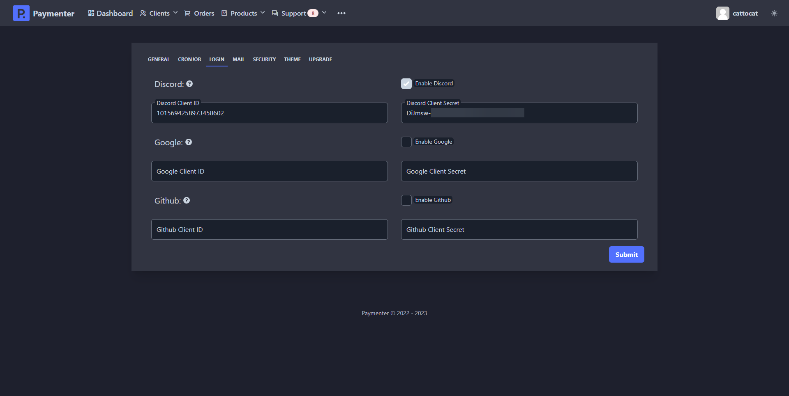

# DiscordOAuth Setup

First locate to [Discord Developer Page](https://discord.dev) and click on New application.

Name your application and hit create.
After that navigate to OAuth2 and click on Add Redirect
and add Paymenter OAuth callback URL (https://yourdomain.here/login/discord/callback).
After that click on Reset Secret, The page should look like this.

Now go to your Paymenter admin area and navigate to settings (... (Three dots) -> Settings --> Login)

Enable Discord feature and fill in the Discord Client ID & Discord Client Secret with the one showed in your Discord's developer page.
Should look like this.

Hit sumbit to save all changes and Discord OAuth should be working and visible in login page.

