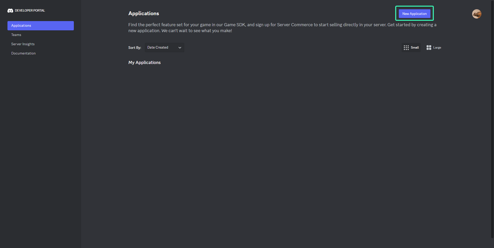
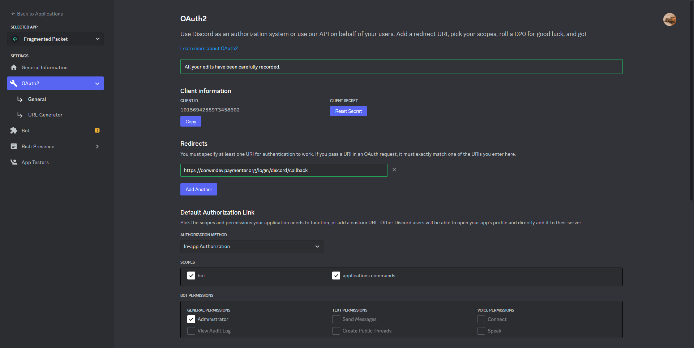
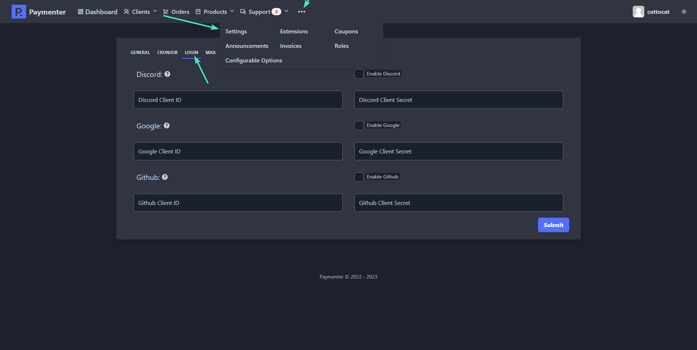
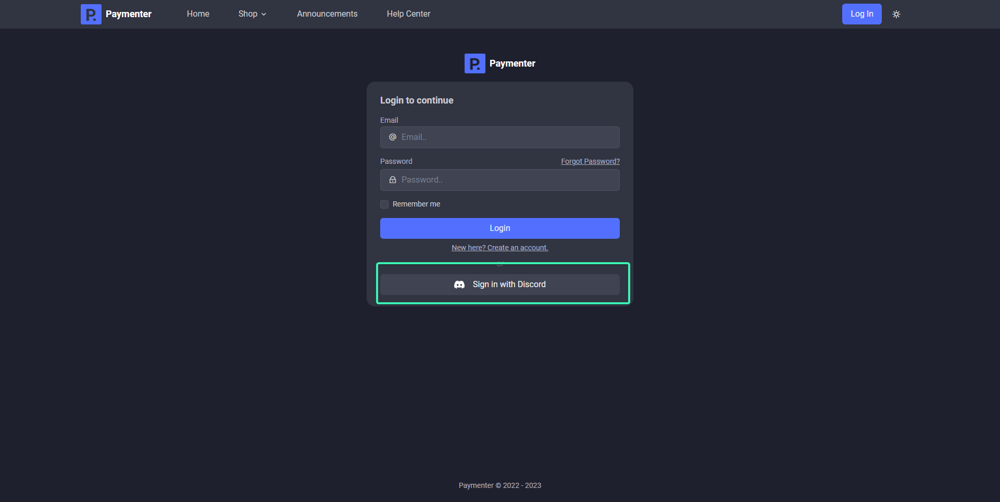
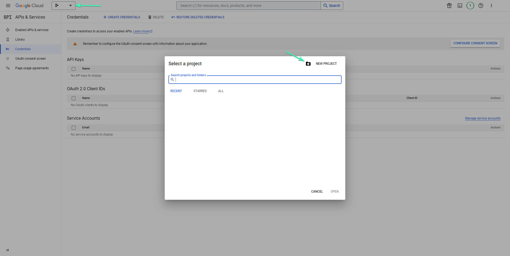
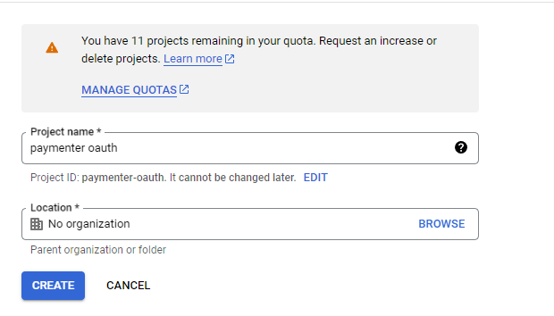
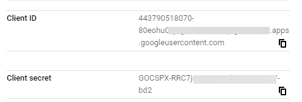

A simple tutorial on how to add oAuth authorization to your Paymenter

## Discord OAuth

First locate to [Discord Developer Page](https://discord.dev) and click on New application.

Name your application and hit create.
After that navigate to OAuth2 and click on Add Redirect
and add Paymenter OAuth callback URL (https://yourdomain.here/login/discord/callback).
After that click on Reset Secret, The page should look like this.

Now go to your Paymenter admin area and navigate to settings (... (Three dots) -> Settings --> Login)

Enable Discord feature and fill in the Discord Client ID & Discord Client Secret with the one showed in your Discord's developer page.
Should look like this.

Hit submit to save all changes and Discord OAuth should be working and visible in login page.

## Github OAuth

Locate to [Github Account Settings](https://github.com/settings/profile) scroll down and click on Developer Settings
as showed in the image.

Click on OAuth Apps and click on Register a new application

Create a new application with the callback (https://yourdomain.here/login/github/callback)
Should look something like this.

Click on Register Application, and Generate a new client secret
The github page should look simillar to this.

Copy your Client ID & Client Secret and deploy it on Paymenter

After that, click on submit to save changes and Github OAuth should be working,
You can verify this by going to the login page and clicking on Sign in with GitHub.

## Google OAuth

Locate to [Google API & Services Dashboard](https://console.cloud.google.com/apis/dashboard)
Click on create a new project

Name your project and click create

After that click on Create Credentials and OAuth client ID

If this is your first application, you will need to configure your consent screen, to continue click on Configure Consent Screen

Click on External user type and click continue

Configure your application and click save and continue

Ignore scopes and click continue

Same for test users, after that scroll down and click on Back to dashboard.
Now lets push our OAuth application to production

After that go back to Credentials and click on Create credentials --> OAuth client ID.

Select Web application and for Authorized redirect URIs put (https://yourdomain.here/login/google/callback)
Should look like this.

Click on create and you should be showed your Client ID and Client Secret

Copy both of these and go to your Paymenter admin area, navigate to settings (... (three dots) -> Settings --> Login) Paste the Client ID and Client Secret and click submit to save changes. 
Should look something like this.

Congratulations, Google's OAuth should be now available for your users.

