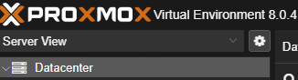
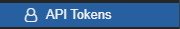
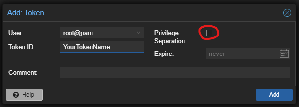
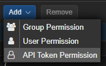
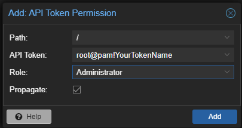
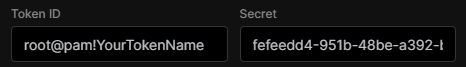
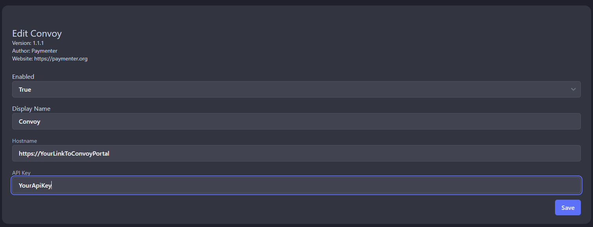

This documentation will cover the whole process configuring Proxmox to talk to Convoy and finally interact with Paymenter.

In order to acomplish this we would need to do the following steps, let's get started:

Proxmox settings:

***For ease of use please also use the binary which downloads an creates the templates inside proxmox, for you:

https://github.com/ConvoyPanel/downloader/releases/download/v1.0.1/downloader

Download it to the node that you will use in this process.

Now using your terminal just do 'chmod +x Downloader' (asumming you are in the same directory with the script) and then do './Downloader', after that wait for it to finish.

1. Login into your proxmox web portal and click on 'Datacenter'

2. On the menu imediatly to the left of that you will find a menu item called 'API Tokens', click on it

3. Click on 'Add', fill in the information like in the image below, also, please make sure to uncheck 'Privilage separation'

4. Just above that click on 'Permissions' and inside that menu and the click on 'Add' -> 'API Token Permissions'

5. Select the same user with we created the token before and add to it the permissions like shown the picture below

Convoy settings:

1. Login into your Convoy web portal

2. Click on your username in the top right corner of the page and click on 'Admin Control Panel'

3. Click on 'Nodes' than 'Create Node'

4. Fill out the information as requested, these is were we're going to use the very same credentials that we created in order to comunicate with Proxmox

5. Click on 'Tokens' and then 'New Token', named it and save it for later.

   Be sure to configure your templates which will corespond to your 'VMID' from the list of templates inside proxmox, just below datacenter, in the node you used the 'Downloader' script, described at the top of this page.

Paymenter settings:

1. Login into your Paymenter web portal

2. Click on your username in the top right corner of the page and then click 'Admin area'

3. Click on the three horizontal dots and the select 'Extensions'

4. Click on 'Browse Extensions'

5. Find Convoy extension and then click 'Download'

6. Once again click on the three horizontal dots and select 'Extensions'

7. Find Convoy in your list and click on the edit button

8. Inside this extension things should look like this:

  Let's make our first package with this extension and see our first VM deployed

9. Go to 'Products' and then 'Categories' and create a categorie for your product