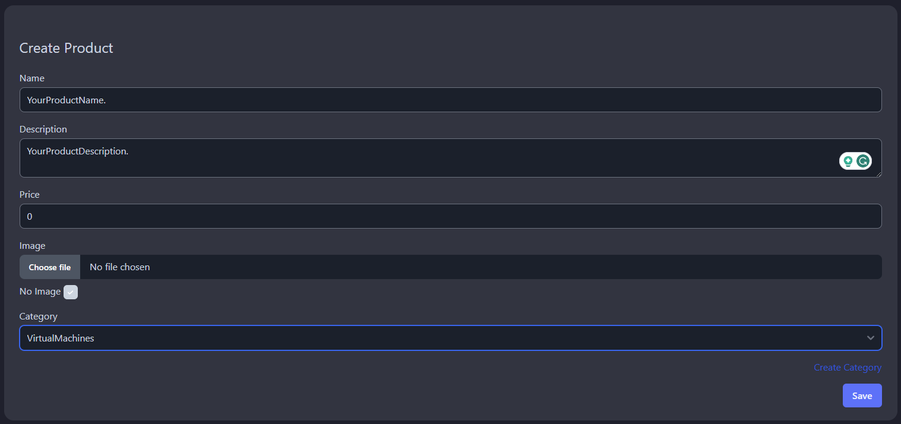
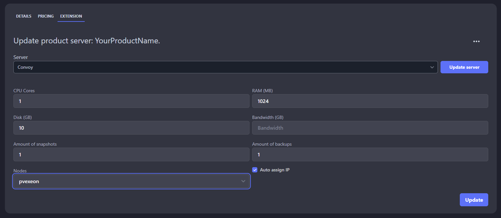

This documentation will cover the connection between Convoy and Paymenter.

Convoy settings:

1.  Login into your Convoy web portal

2.  Click on your username in the top right corner of the page and click on 'Admin Control Panel'

3.  Click on 'Nodes' then 'Create Node'

4.  Fill out the information as requested, these are where we're going to use the very same credentials that we created in order to communicate with Proxmox.

5.  Click on 'Tokens' and then 'New Token', name it, and save it for later.

Paymenter settings:

1.  Login into your Paymenter web portal

2.  Click on your username in the top right corner of the page and then click 'Admin area'

3.  Click on the three horizontal dots and then select 'Extensions'

4.  Click on 'Browse Extensions'

5.  Find Convoy extension and then click 'Download'

6.  Once again click on the three horizontal dots and select 'Extensions'

7.  Find Convoy in your list and click on the edit button

8.  Inside this extension things should look like this:

  Let's make our first package with this extension and see our first VM deployed

9.  Go to 'Products' and then 'Categories' and create a category for your product

10. Go to 'Products' again and click on 'Create Product'

11. Your new product should look like this:

***Notice: The fact that we put in '0' for the price is because we want to test first, that it creates the VM without any manual intervention.

12. After you save your product you should have another tab available called 'Extension', click on it

13. Select the extension 'Convoy' and click on 'Update server'

14. In the fields that just appeared below fill out your desired values for this product, here is an example below:

15. This should be it, now you can order this package from the front page of Paymenter and see your VM being deployed without any issues.

***Notice: I have not put anything in the 'Bandwidth' section, because I don't usually limit the bandwidth used, but you can do that there. Also make sure you have added some IPV4 ip addresses to your Convoy node that you just added earlier in this documentation.

***Notice: This documentation will be updated as necessary.
