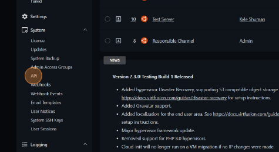
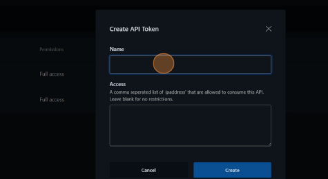
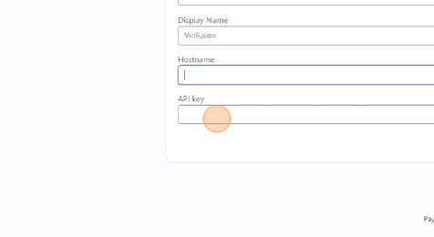
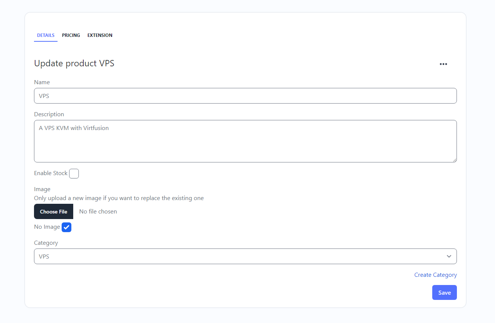

# Virtfusion

## Overview

 Virtfusion is a VPS Control panel. With modern UI and state of the art features.

Learn More [here](https://virtfusion.com/)

## Prerequisites

- Packages made in virtfuion  
- Virtfusion Control Panel installed and functional  
- Functional Virtfusion Instance  
- Virtfusion Email setup for client access

## Setup

## Navigate to vps.yoursite.org/admin/dashboard

### Click API

### Create a Token

### Name your token and add access settings

 

### Copy your token (This is important it only appears one time!)

 

### Go to paymenter Extensions Virtfusion Edit

### Enter an hostname(eg. https://vps.yoursite.org) and your token (from the previous step)

 

### Enable the module

### Creating a product with Virtfusion

Create the Product

### Add the Package ID You created when seting up virtfusion, and other details

Thats it! Now your clients can order VPS's from your site!
