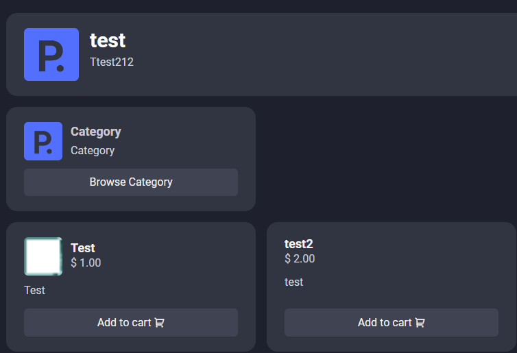
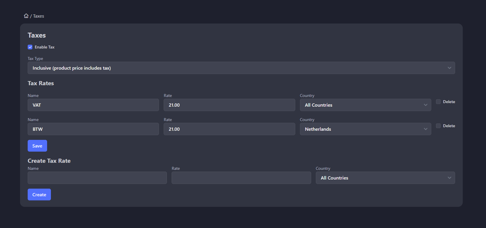
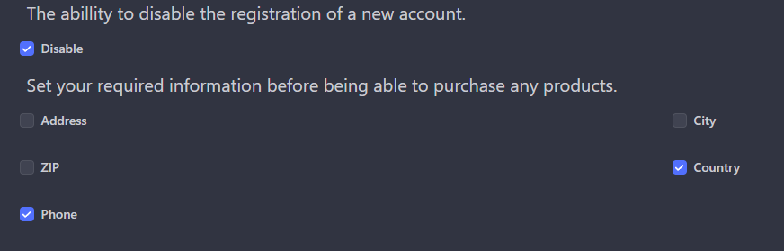
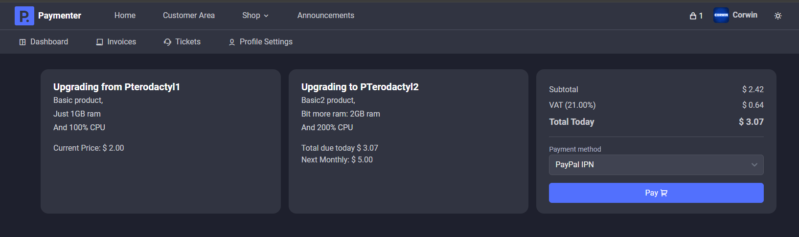
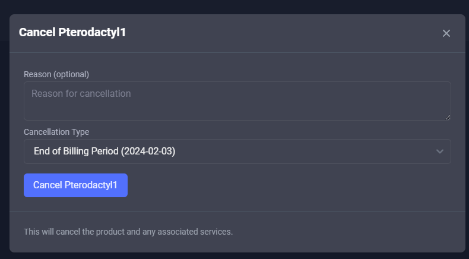

# Paymenter Version 9.0 Release Notes

## Category Enhancements:

- **Subcategories**: Now introducing the ability to create subcategories for a more organized product structure.
- **Category Images**: Enhance your product presentation with the inclusion of images at the category level.

## [NEW FEATURE] Subscriptions

- **Subscription Management**: Users can now subscribe to your product, enabling automatic and seamless recurring charges.

## [NEW FEATURE] Taxes:

- **Global Tax Settings**: Set tax rates for each country, specifying whether it is inclusive or exclusive of the current price.
  

## Ticketing System Improvements:

- **Dynamic Messaging**: Experience live message updates within tickets for smoother communication.
- **Ticket Closure Fix**: Tickets can no longer be reopened once closed.

## Extension Updates:

- **Checkout Gateway Configuration**: Specify the availability of your checkout gateway for the current invoice/checkout based on specific conditions.
- **Pterodactyl Extension Enhancements**: Introduce port array support for Pterodactyl extension, especially useful for selling game servers requiring multiple ports. Also, added Single Sign-On (SSO) support for Virtualizor.

## New Commands:

- **MakeTheme**: Easily create and customize themes with the new MakeTheme command. This command copy's the default theme.

## Register/Checkout Requirements:

- **User Information Requirements**: Configure mandatory information needed during user registration and/or checkout processes.

## [NEW BETA FEATURE] Upgrade / Downgrade Functionality (Pterodactyl Only)

- **Client Product Adjustment**: Allow clients to upgrade or downgrade their Pterodactyl products seamlessly.

## [NEW FEATURE] Close / Cancel Button

- **Client Control**: Empower clients to close or cancel their products/subscriptions at their convenience.

## Frontend Enhancements:

- **Admin Panel UI Tweaks**: Experience a more polished admin panel interface with small but impactful changes.
- **Breadcrumbs for Navigation**: Improved navigation with the addition of breadcrumbs.
- **Livewire Checkout**: Real-time updates on prices and totals during the checkout process.
- **Pagination for Backend Tables**: Better organization and accessibility with paginated tables in the backend.

## Additional Changes

- **Language Input Update**: Changed languages input to a more user-friendly select format.
- **Cronjob Optimization**: Cronjob now runs once a day for efficiency.
- **Error Logging**: Added error logging within Paymenter for better issue tracking.
- **Backend Optimization**: General optimizations for a smoother backend experience.

## Bug Fixes:

- Refer to [GitHub Release Page](https://github.com/Paymenter/Paymenter/compare/v0.8.2...v0.9) for detailed bug fixes and improvements.
